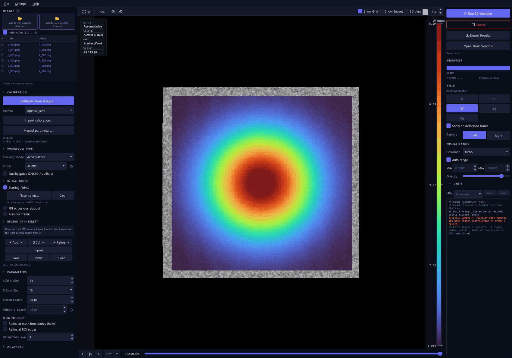
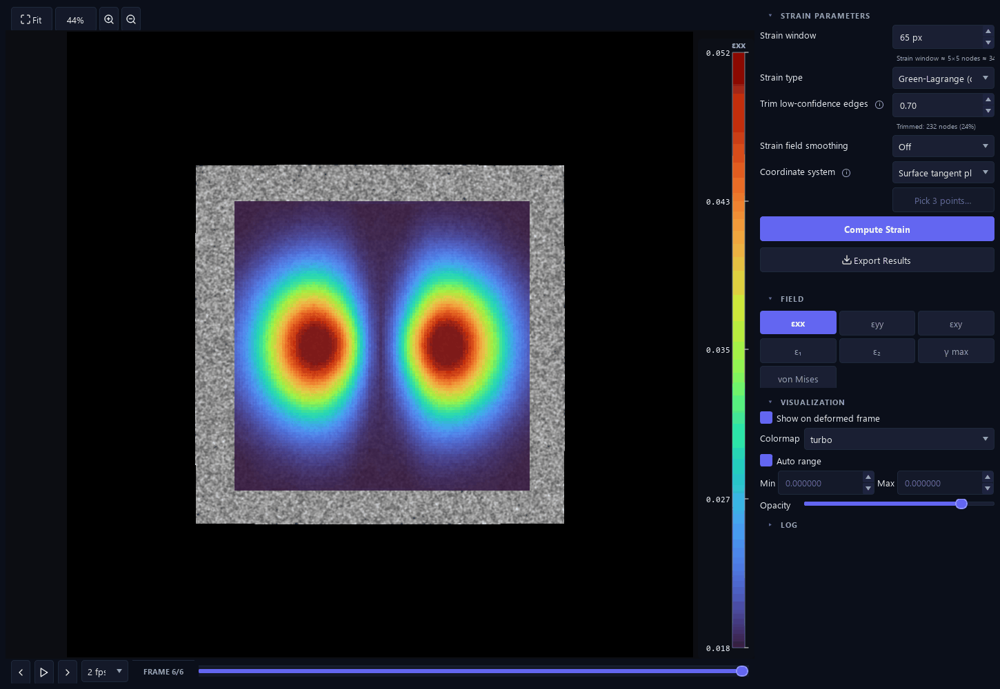
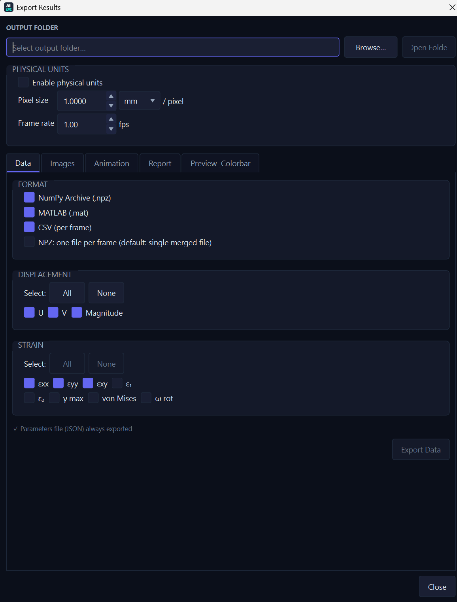

# pyALDIC-3D

**Stereo / 3D Digital Image Correlation desktop application — full-field 3D shape,
displacement, and surface strain from a synchronized two-camera setup.**

<p align="center">
  <a href="https://github.com/zachtong/pyALDIC-3D/actions/workflows/ci.yml"></a>
  
  
  
  
  
</p>

<p align="center">
  
</p>

---

## What it is

pyALDIC-3D is an **independent, self-contained application** for stereo (two-camera)
Digital Image Correlation. Point it at two synchronized image sequences and a stereo
calibration, and it reconstructs the specimen surface in 3D and tracks its
**displacement and Green–Lagrange surface strain** through the sequence — all in
**millimetre-native world coordinates** (the left camera is the world origin).

It is built **on top of** the [pyALDIC-2D](https://github.com/zachtong/pyALDIC) platform
([arXiv:2607.22755](https://arxiv.org/abs/2607.22755), preprint under review), which it
consumes as a **pinned, read-only library** (`al-dic==0.7.*`) for the
underlying 2D correlation engine (Augmented-Lagrangian DIC: local IC-GN subproblems
coupled to a global FEM regularizer). Everything above the 2D solver — stereo
calibration, correspondence strategies, triangulation, 3D surface strain, the 3D
visualization layer, the project format, and the workflow — is pyALDIC-3D's own.

The algorithm follows the MATLAB **[3D-Stereo-ALDIC](https://github.com/zachtong/3D-Stereo-ALDIC)**
reference (*Tong et al., Experimental Mechanics, 2025*) as a mathematical model, ported
into idiomatic, tested Python — not a literal translation.

> **Scope (honest):** v1 supports a **two-camera stereo rig**. The data model is
> N-camera-ready, but **N-camera (>2) support is planned for post-v1**.

---

## Key features

| Area | Highlights |
|---|---|
| **Calibration** | Built-in OpenCV stereo calibration (chessboard, ChArUco, circle-grid, and a self-developed **coded circular-target** detector) with per-image QC, worst-pair rejection, epipolar validation, and optional bundle adjustment — **or** import from 6 external formats. |
| **Correspondence & tracking** | Three pluggable strategies (`track_both`, `stereo_each_frame`, `ref_direct`); accumulative & incremental reference modes with Every-Frame / Every-N / Custom reference update; AL-DIC global step + local IC-GN; FFT, multi-seed Starting-Points propagation, or previous-frame initial guess; quadtree mesh refinement; ROI toolbox; quality + honesty gates. |
| **3D reconstruction & strain** | DLT triangulation to a metric surface; surface strain via plane-fit + Green–Lagrange, with **3 strain types** (Green–Lagrange / infinitesimal / Euler–Almansi), **3 coordinate systems** (fitted-plane / left-camera / custom 3-point), edge-trim, and a Numba-accelerated kernel. |
| **Crack-aware DIC** | Detects a thin masked barrier in the ROI, cuts the mesh so the FEM/global step never bridges the crack, and applies crack-aware strain neighbour exclusion + trimming. |
| **Visualization & export** | Interactive PyVista 3D view with camera frusta; dense continuous field rendering; display units (µm / mm / cm / m) and a velocity field; export to NPZ / MAT / CSV / PLY / VTU+PVD, per-frame field images, MP4/GIF animation, 3D-render sequences + 360° turntable, with a WYSIWYG Preview & Colorbar tab. |
| **Workflow & sessions** | Single-window three-column GUI; `.aldic3d` project sessions (config, view, **and** computed results) with source-image relocation and Windows file association; a headless TOML-driven CLI for batch/scripted runs. |
| **i18n & robustness** | GUI translated into **8 languages** (en, zh_CN, zh_TW, ja, ko, de, fr, es); pre-run RAM check with fail-fast projection; partial-results-kept-on-cancel; per-frame validity diagnostics surfaced in the log. |

<p align="center">
  
  &nbsp;
  
</p>

---

## Install

pyALDIC-3D targets **Python ≥ 3.10** and installs from source (it is in active
pre-release development). The `al-dic==0.7.*` 2D engine resolves automatically from PyPI.

```bash
# 1. Create an environment (conda shown; a venv works too)
conda create -n pyaldic3d python=3.12
conda activate pyaldic3d

# 2. Clone and install with the GUI + 3D-view extras
git clone https://github.com/zachtong/pyALDIC-3D.git
cd pyALDIC-3D
pip install -e ".[gui,viz3d]"
```

**Optional-dependency extras** (compose as needed, e.g. `.[gui,viz3d,dev]`):

| Extra | Pulls | Needed for |
|---|---|---|
| *(none)* | numpy, scipy, OpenCV, `al-dic` | headless compute + `al-dic-3d run` / `calibrate` |
| `[gui]` | PySide6 | the desktop GUI (`al-dic-3d gui`) |
| `[viz3d]` | pyvista, pyvistaqt (VTK) | the interactive 3D view + 3D-render export |
| `[dev]` | pytest, ruff, pre-commit, matplotlib | running the test suite + reports |

The base install is **headless** (no Qt/VTK), so the compute layer and CLI run on
servers and CI without a display.

<details>
<summary><b>Developing against the sibling 2D repo</b></summary>

The 2D platform is consumed as a **pinned, read-only** dependency. To develop against a
local checkout instead of the PyPI wheel, install the sibling repo editable first — it
satisfies the same `al-dic==0.7.*` pin:

```bash
pip install -e ../pyALDIC     # 2D engine, editable (reports 0.7.x)
pip install -e ".[gui,viz3d,dev]"
pre-commit install            # optional hooks
```

pyALDIC-3D never modifies the 2D repo; `docs/DEPENDS_ON_2D.md` is the ledger of exactly
which `al_dic` symbols it uses.
</details>

---

## Quickstart

The repo ships a tiny sample dataset under
[`examples/Images_Stereo_Sample3_images/`](examples/Images_Stereo_Sample3_images) — three
synchronized left/right stereo pairs of a speckled D-specimen (Stereo-DIC Challenge 1.0
"Sample 3") plus a DICe-format calibration. It is small (3 frames), but enough to run the
full pipeline end to end.

### GUI

```bash
al-dic-3d gui
```

Then follow [`examples/quickstart/README.md`](examples/quickstart/README.md): load the
`L/` and `R/` folders as the left/right cameras, import `cal.xml` as the calibration, draw
an ROI, click **Run 3D Analysis**, and inspect the displacement/strain fields and the 3D
view.

### CLI (headless)

A ready-to-run config lives at
[`examples/quickstart/config.toml`](examples/quickstart/config.toml):

```bash
al-dic-3d run examples/quickstart/config.toml -o examples/quickstart/out
```

This reconstructs the surface and computes surface strain for all three frames and writes,
under `-o`:

- `quickstart.npz` / `quickstart.mat` — the unified result archive: `points3D`
  `(n_frames, n_pts, 3)`, per-frame displacement stacks `U` / `V` / `W` / `mag`, strain
  stacks `exx` / `eyy` / `exy` / `e1` / `e2` / `max_shear` / `von_mises`, plus the raw
  correspondence (`xL` / `xR` / `quality` / `reproj_error`).
- `quickstart_parameters_<timestamp>.json` — the full run configuration (always written).

Verified run: **3 frames, ~1,300 nodes, median per-frame validity 100 %**, completing in
seconds on a laptop. The reconstructed surface sits ~377–390 mm from the left camera
(world origin), consistent with the calibration.

---

## CLI reference

`al-dic-3d` (equivalently `python -m al_dic_3d`) has three subcommands:

### `run` — headless pipeline

```
al-dic-3d run CONFIG [-o DIR] [-q] [--formats LIST]
```

| Flag | Meaning |
|---|---|
| `CONFIG` | path to the run configuration (TOML) |
| `-o, --output DIR` | override `[output].dir` from the config |
| `-q, --quiet` | suppress per-frame progress output |
| `--formats LIST` | comma-separated: `npz,mat,csv,ply,vtu` (default `npz,mat`; a parameters JSON is always written) |

Config sections: `[calibration]` (`file`, `format`), `[sequence]` (`left`, `right`,
optional masks), `[roi]` (`xmin/xmax/ymin/ymax`, or an arbitrary-shape `mask` image),
`[matching]` (strategy, reference mode, subset/step, search ranges, initial guess, …),
`[strain]`, `[quality]`, `[output]`, `[advanced]`. See the shipped
[`config.toml`](examples/quickstart/config.toml) for a minimal example.

### `gui` — desktop application

```
al-dic-3d gui [SESSION]
```

Launches the workflow GUI (requires the `[gui]` extra). An optional `.aldic3d` project
path opens straight into that session.

### `calibrate` — built-in stereo calibration

```
al-dic-3d calibrate --left GLOB --right GLOB --board {chessboard,charuco,circles,coded} \
                    --cols COLS --rows ROWS [--square MM | --spacing MM] [-o OUT.yaml] ...
```

Detects the board in synchronized L/R image sets, solves per-camera intrinsics + stereo
extrinsics with QC (worst-pair rejection, epipolar validation), and writes an OpenCV YAML
that `run` consumes as `[calibration] file=... format=opencv_yaml`. Options include
`--marker`/`--dict` (ChArUco), `--spacing`/`--dot`/`--asymmetric` (circle/coded boards),
`--joint`, `--tangential`, `--fix-k3`, `--release-object`, `--bundle`, and
`--verify-left/--verify-right` for independent known-distance verification. Run
`al-dic-3d calibrate --help` for the full list.

---

## Calibration

Calibration is the accuracy-critical step in stereo-DIC. pyALDIC-3D gives you three paths,
all converging on one internal stereo rig:

1. **Built-in calibration** (recommended) — OpenCV-based, from board image pairs, with QC
   the MATLAB reference does not have (per-image error bars, threshold-based rejection +
   re-solve, coverage/pose diagnostics). Supports chessboard, ChArUco, circle grids, and a
   custom **coded circular target** (three concentric locator rings).
2. **Import** an existing calibration from one of **6 formats** — MATLAB/OpenCV
   (`matlabcv`), MatchID (`matchid`), MMC (`mmc`), DICe (`dice`), OpenCorr (`opencorr`), or
   OpenCV-YAML (`opencv_yaml`).
3. **Manual entry** of intrinsics/extrinsics as a fallback.

Correspondence is computed on **raw (unrectified) images**; distortion is removed on point
coordinates only, immediately before triangulation, so the speckle is never resampled.

---

## Positioning

pyALDIC-3D is the **Python successor to the MATLAB 3D-Stereo-ALDIC** code — the same
AL-DIC stereo-DIC method, re-implemented as a tested, GUI-driven, self-contained
application with a built-in calibration front end and a modern 3D visualization/export
layer.

Relative to other open stereo-DIC tools: MATLAB-based **MultiDIC** offers N-camera (>2)
support that pyALDIC-3D does **not** yet have (N-camera is planned post-v1); pyALDIC-3D's
differentiators are the Augmented-Lagrangian global–local solver, adaptive quadtree
refinement, built-in QC-instrumented calibration, and a Python/Qt stack with no MATLAB
license requirement. No head-to-head accuracy benchmark is claimed here — see the
validation reports in the architecture docs for measured results.

---

## Documentation

- **User guide** — [`docs/user-guide/`](docs/user-guide/) (start at
  [`index.md`](docs/user-guide/index.md)): overview, installation & launching, and
  task-oriented walkthroughs.
- **Architecture & decision baseline** — [`docs/architecture/`](docs/architecture/) (start
  at [`00_INDEX.md`](docs/architecture/00_INDEX.md)): technical baseline, correspondence-
  strategy study, decision log, and the full version changelog.
- **Reference notes** — [`docs/COORDINATES.md`](docs/COORDINATES.md),
  [`docs/strain3d_math.md`](docs/strain3d_math.md),
  [`docs/DEPENDS_ON_2D.md`](docs/DEPENDS_ON_2D.md).

---

## Citation

pyALDIC-3D has its **own scholarly identity**, independent of the 2D project. A dedicated
Zenodo record (concept DOI) and a standalone *SoftwareX* article ("Part 2") are
forthcoming; this section will be updated on publication.

Until then, if you use pyALDIC-3D in your research, please cite the underlying method, the
MATLAB reference it ports, and the 2D software it is built on:

```bibtex
@article{tong2025stereoaldic,
  author  = {Tong, Zixiang and Yang, Jin},
  title   = {3D Stereo Adaptive Mesh Augmented Lagrangian Digital Image Correlation},
  journal = {Experimental Mechanics},
  year    = {2025},
  doi     = {10.1007/s11340-025-01225-7}
}

@article{yang2019aldic,
  author  = {Yang, Jin and Bhattacharya, Kaushik},
  title   = {Augmented Lagrangian Digital Image Correlation},
  journal = {Experimental Mechanics},
  volume  = {59},
  pages   = {187--205},
  year    = {2019},
  doi     = {10.1007/s11340-018-00457-0}
}

@article{tong2026pyaldic,
  author  = {Tong, Zixiang and Yang, Jin},
  title   = {pyALDIC: A Python Implementation of Augmented Lagrangian Digital
             Image Correlation with a GUI, Adaptive Meshing, and Mask-Aware
             Subset Splitting},
  journal = {arXiv preprint arXiv:2607.22755},
  year    = {2026},
  doi     = {10.48550/arXiv.2607.22755},
  url     = {https://arxiv.org/abs/2607.22755}
}
```

The last entry describes the 2D software this application builds on — its architecture,
adaptive quadtree meshing and mask-aware subset splitting — and is a **preprint under
review**, not peer-reviewed yet.

*A pyALDIC-3D software DOI (Zenodo) and the SoftwareX "Part 2" citation will be added here
when available.*

---

## License

BSD 3-Clause. See [LICENSE](LICENSE).

## Acknowledgements

pyALDIC-3D is built on the **[pyALDIC](https://github.com/zachtong/pyALDIC)** 2D platform
(the `al-dic` package, described in [arXiv:2607.22755](https://arxiv.org/abs/2607.22755) —
preprint under review) and follows the MATLAB
**[3D-Stereo-ALDIC](https://github.com/zachtong/3D-Stereo-ALDIC)** reference. Developed in
[Dr. Jin Yang's group](https://sites.utexas.edu/jyang/) at **The University of Texas at
Austin**.
